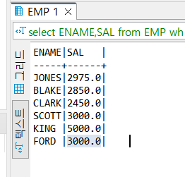
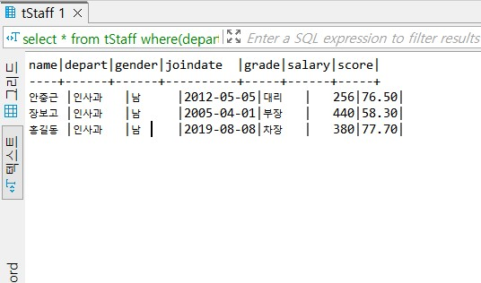

# Scala Function
> 하나의 데이터를 받아서 하나의 데이터를 리턴하는 함수
- 컬럼을 데이터로 제공하면 각 컬럼의 데이터 단위로 작업을 수행한 후 결과를 하나의 컬럼으로 만들어서 리턴

### 수치 함수
> 숫자 연산 과 관련된 함수로 올림, 버림, 반올림 등의 함수가 제공된다.
- 데이터는 숫자 데이터여야 한다.
- FROM 절을 제외한 곳에서 사용이 가능하다.
- EMP 테이블에서 EMPNO 가 홀수인 데이터를 조회 
```
select *
from EMP
where mod(EMPNO,2)=1;
```

### 문자열 함수
- CONCAT :문자열결합
- UPPER, LOWER
- LTRIM , RTRIM ,TRIM : 공백제거 
- SUBSTRING: (str,pos,len) 
    - str:원본 문자열
    - pos:시작 위치값
    - len: 가져올 길이 값
- LENGTH
- EMP 테이블에서 1982년에 입사한 사원의 ENAME과 SAL 을 조회 
```
select ENAME,SAL
from EMP
where HIREDATE >= '19820101' and HIREDATE <= '19821231';


select ENAME,SAL
from EMP
where SUBSTRING(HIREDATE,1,4)='1982';
```
### 날짜 관련 함수
- 현재 날짜 및 시간

```
CURRENT_DATE(),CURDATE() -> 현재 날짜 
CURRENT_TIME(),CURTIME() -> 현재 날짜 
NOW(),LOCALTIME(),LOCALTIMESTAMP(),CURRENT_TIMESTAMP() -> 현재 날짜 및 시간
```

- 날짜 및 시간 연산 함수
    - ADDATE
    - SUBDATE
    - ADDTIME
    - SUBTIME

- 특정 날짜 생성
    - STR_TO_DATE(문자열,서식): 서식에 맞춰서 문자열을 날짜 형태로 변환
```
('1986-05-05 11:00:00','%Y-%M-%D %H:%i:%S')
mysql이나 mariadb는 일반적인 날짜 포맷의 문자열도 날짜로 간주

STR_TO_DATE('1986-05-05','%Y-%M-%D'),'1986-05-05'
날짜에서 많이 사용하는 모맷으로 날짜로 간주
```
- 참고 정훈
    - https://extbrain.tistory.com/78

### 시스템 정보 함수 
- ROW_COUNT()
- USER()
- DATABASE()

### 타입 변환 함수
- CAST(데이터 as 자료형)
    - 자료형
        - DATETIME
        - DATE
        - TIME
        - CHAR(varchar, TEXt)
        - INT 
        - DOUBLE
        - BINARY

### NULL 관련 함수
- IFNULL(데이터1,데이터2)
    - 데이터 1이 null이 아니면 데이터1을 리턴하고 데이터1이 null이면 데이터2를 리턴
- NULLIF (데이터1,데이터2)
    - 두 개의 데이터가 같으면 NULL을 리턴하고 그렇지 않으면 데이터1을 리턴
- COALESCE(데이터 나열)
    - 나열된 데이터 중 NULL이 아닌 첫번째 데이터를 리턴
- 데이터베이스에서는 NULL 과 연산을 하면 결과는 NULL

### 분기 관련 함수
- IF
- CASE 데이터 WHEN 값 THEN 결과 ElSE 결과

- 정훈 참조 
    - https://extbrain.tistory.com/46

### GROUPING
> 그룹화 관련된 기능

- 그룹함수
    - COUNT :개수
    - SUM :합계
    - AVG : 평균
    - MAX : 최대값
    - MIN : 최소값
    - STDDEV : 표준편차
    - VARIANCE: 분산

- 특징 
    - NULL을 제외하고 연산
    - COUNT 를 제외한 모든 함수는 컬럼 이름 이나 연산식을 대입해야 하지만 COUNT 는 * 이가능 
        - COUNT(*)는 모든 컬럼이 NULL인 경우 제외하고 데이터의 개수를 계산
    - SUM 과 AVG,STDDEV,VARIANCE는 문자열에는 사용 못함
    - GROUP BY 이후 부터 사용 가능 
        - HAVING
        - SELECT
        - ORDER 에서 사용가능

- SELECT 절에 사용할 때는 대부분 별명과 함께 사용

- 그룹함수 
```
tStaff 테이블에서 score의 평균구하기 

select ROUND( AVG (score),0)
from tStaff;

// 66

select ROUND(SUM(score)/ COUNT (*),0)
from tStaff;

//데이터가 null 인경우는 0으로간주 
```

### COUNT 
```

select count(score)
from tStaff;
```


### GROUPING
> select 구문에서 데이터를 그룹화 하고자 할 때 사용하는 절
- where 절 다음에 수행
- 이 절이 수행되어야 그룹 함수를 사요하는 것이 가능
    - where 절에서는 그룹 함수를 사용 할  수 없음

- EMP 테이블에서 부서별(DEPTNO) 평균 급여(SAL) 조회
```
select DEPTNO,ROUND(AVG(SAL),0)
from EMP
group by   DEPTNO;
```
- 그룹화 한 항목을 제외하고 출력하면 데이터를 알아보기각 어렵기 때문에 그룹화 한 항목과 같이 조회

- 그룹화 는 여러개 가능
```
select DEPTNO,JON,ROUND(AVG(SAL),0)
FROM EMP
GROUP BY DEPTNO,JOB
```

- 그룹화 한 후 select 절에서 그룹화 한 항목이나 집계 함수가 아닌 데이터의 조회
    - oracle은 에러이고 mysql이나 mariadb는 그룹화 한 항목 중 첫번째 데이터 조회 


### HAVING
> GROUP BY 이후의 조건을 설정해서 행 단위로 추출
- <b>그룹 함수는 WHERE 절에서 사용 불가하기 때문에 </b>그룹 함수를 이용한 조건을 설정할 때는 HAVING에 작성해야함.


```
#tStaff 테이블에서 depart 별로 그룹화해서 평균 salary 가 340이 넘는 부서의 depart와 평균 salary를 조회

select depart, AVG(salary)
from tStaff
GROUP By depart
HAING AVG(salary) >340
```

### window 함수 
> 행 과 행 사이의 관계를 표현하기 위한 함수
- 순위나 누적합 등의 연산을 위한 함수
- 순위 함수로는 동등한 값일 떄 어던식으로 처리하는 냐에 따라 여러 함수를 제공하고 N등분한 그룹도 제공해주는 함수
    - RANK
    - DENSE_RANK
    - ROW_NUMBER
    - NTITLE
- 함수 뒤에 OVER를 이용해서 순위를 구할 방법을 ORDER BY로 제공해야함

```
# EMP 테이블에서 SAL 의 오름차순 순위
select ROW_NUMBER() OVER(ORDER BY SAL ASC),ENAME,SAL
FROM EMP;

# EMP 테이블에서 SAL 의 오름차순 정렬해서 4개의 그룹으로 분할
select NTILE(4) over(ORDER BY SAL ASC),ENAME,SAL
from EMP;
```

### JSON 출력
> 데이터를 조회할 때 JSON_OBJECT 로 감싸면 JSON 문자열을 리턴
```
select JSON_OBJECT('name',ENAME,'salary',SAL)
from EMP;
```

## SET Operator
> 개요 
- 동일한 테이블 구조를 가진 2개의 테이블을 가지고 수행하는 연산
    - 테이블 구조가 같다는말은 컬럼의 개수가 같아야하고 컬럼의 자료형이 일치해야한다. 
    - 컬럼의 이름이나 테이블의 이름은 아무런 상관이 없음.
        - 종류로는 UNION,UNION ALL,INTERSECT, EXCEPT(MINUS 인 데이터 베이스도 있음)
    - 컬럼의 이름은 첫 번째 테이블의 컬럼 이름을 사용
    - ORDER BY 는 마지막에 한 번 만 작ㅈ성
    - 데이터의 자료형이 BLOB,CLOB,BFILE,LONG(데이터의 사이즈가 너무 커서 일치 여부를 판단하는데 시간이 많이 걸리기 때문) -이자료형들은 index를 생성하지 않는다.
- 데이터가 분산되어 있는 경우 연산의 결과를 합칠 때 사용
- 데이터가 분산되어 있을 때 처리방식
    - 데이터를 모은 후 처리
    - 데이터를 처리한 후 결과를 모으는것
        - 속도가 빠른 경우가 많음.Map Reduce
- UNION: 결과를 합칠때 중복되는 행은 하나만 표시해줍니다 
- UNION ALL : 중복제거를 하지 않고 모두 합쳐서 보여준다.
- 정훈 참조 
    - https://dpdpwl.tistory.com/98


## 실습
 - DEPT 테이블의 DEPTNO와 EMP 테이블의 DEPTNO의 합집합
 ```
select DEPTNO
from DEPT 
UNION
SELECT DEPTNO
from EMP;


select DEPTNO
from DEPT 
UNION ALL
SELECT DEPTNO
from EMP;
```


 - DEPT 테이블의 DEPTNO와 EMP 테이블의 DEPTNO의 교집합
    - TableA 와 TableB 가 일치하는 결과를 리턴 

 ```
 select DEPTNO
from DEPT 
INTERSECT
SELECT DEPTNO
from EMP;
 ```


 - DEPT 테이블의 DEPTNO와 EMP 테이블의 DEPTNO의 차집합

    - TableA  Row 내용 중 TableB와 Row 내용이 같지 않거나<br/> TableA 에는 있는데 TableB에는 없는 데이터를 리턴 

 ```
 select DEPTNO
from DEPT 
EXCEPT
SELECT DEPTNO
from EMP;
 ```


## SubQuery 
> 다른 SQL 구문 안에 포함된 쿼리 
- Sub Query 는 SELECT 구문 
- SUb Query 는 반드시 괄호 안에 작성
- Sub Query 는 포함하는 Query가 실행되기 전에 한 번 만 실행됨.

### 분류 
> 위치에 따른 분류 
- FROM 절이 아닌 경우 :Sub Query
- FROM 절에 사용된 경우 : Inline View

### 리턴되는 데이터에 따른 분류 
- 단일 행 Sub Query
    - 리턴되는 결과가 하나의 행
- 다중 행 Sub Query
    - 2개이상의 행이 리턴되는 경우
### 사용하는 경우

- EMP 테이블에서 ENAME 이 MIRROR 인 사원 과 동일한 DEPTNO를 가진 사원의 ENAME 을 조회하고자 하는경우
    - EMP 테이블에서 ENAME이 MIRROR 인 사원의 DEPTNO를 구해야하고 그런 다음 그 DEPTNO 와 동일한 DEPTNO를 가진 사원의 ENAME을 조회

```
# subquery 

select ENAME
from EMP 
WHERE DEPTNO =(select DEPTNO
FROM EMP
WHERE  ENAME= 'MILLER');
```
- SubQuery를 사용할 댄 항상 ()로 감싸주어야함


### 실습
- tCity 테이블에서 popu가 최대인 도시의 name을 조회
```
select name,MAX(popu)
from tCity;
# 위처럼 작성하게 되면 popu 가 최대인 데이터가 2개이상 존재할경우 1개만조회됨 그룹화를해주어야한다

select name
from tCity
where popu (select MAX(popu) from tCity);
```

<br/>

### 다중 열 Sub Query
- tStaff 테이블에서 name 이 안중근 인 데이터 와 depart 와 gender가 일치하는 데이터를조회 

```
select *
from tStaff
where(depart,gender)= (select depart,gender from tStaff where name='안중근');
```



### 다중 행 Sub Query
- Sub Query 에서 리턴되는 결과가 2개 이상의 행인 경우 
    - 이경우에는 =,<>, 는 사용이 안되고 >,>=,<,<= 도 단독으로 사용안됨
    - =,<>는 하나의 데이터 와 비교 가능한 단일행 연산자 이기 때문이다 .
    - 이런 경우에는 IN 이나 NOT IN 그리고 ANY와 ALL같은 다중 행 연산자를 사용해야한다.

        - ANY와 ALL은 MAX와 MIN 함수로 대체가 가능하다.
- EMP 테이블에서 DEPTNO 별로 그룹화 해서 각 그룹의 SAL 이 최대인 데이터와 일치하는
SAL 을 가진 데이터의 ENAME 과 SAL을 조회 

```
# DEPTNO 별 SAL 최대값 조회 

# 서브쿼리가 2개이상 리턴하므로 IN 을 사용
select ENAME ,SAL
from EMP
WHERE SAL IN(select MAX(SAL) from EMP GROUP BY DEPTNO);
```

- EMP 테이블에서 DEPTNO 가 30인 데이터의 모든SAL 보다 많은 SAL을 받는 직원의 ENAME과 SAL을 조회 

```
select ENAME ,SAL
from EMP
WHERE SAL IN(select MAX(SAL) from EMP GROUP BY DEPTNO);

```

## JOIN
> 2개 이상의 테이블을 합쳐서 하나의 테이블을 만드는것 
- 2개의 테이블이 동일한 테이블 일 수 도 있음.

- 조회하고자 하는 데이터가 2개 이상의 테이블에 나누어져 있거나 하나의 테이블에서 2번 이상 찾아야하는 경우 사용.
### join 에서 테이블의 순서
- 선행 테이블에 조건을 설정해서 데이터를 추출한 후 후행 테이블의 데이터를 결합하는 방식 조건을 확인해서 데이터의 추출 개수가 적은 테이블을 선행 테이블로 사용해야 한다.

- 한쪽 테이블에만 적용되는 조건이라면 그 조건이 적용되어야 하는 테이블을 먼저 기재하는 것이 좋다.
## 종류

### 정훈 참조  (JOIN)
- https://hongong.hanbit.co.kr/sql-%EA%B8%B0%EB%B3%B8-%EB%AC%B8%EB%B2%95-joininner-outer-cross-self-join/

### Cartesian Product 
- Croos Join 이라고도 하는데 단순하게 2개 테이블의 모든 조합을 만들어내는것
- 양쪽 테이블의 모든 데이터 조합을 만들어냄 
- 컬럼의 수는 양쪽 테이블의 컬럼의 수의 합이 되고 행의 수는 양쪽 행의 수의 곱
```
cross join

select *
from EMP,DEPT;
``` 

### Equi Join 
- 양쪽 테이블에 동일한 의미를 갖는 컬럼이 존재할 때 2개의 컬럼의
 값이 일치하는 경우에만 결합하는 것으로 Inner Join 이라고도 함
- 양쪽 테이블의 동일한 의미를 갖는 컬럼의 값이 일치하는 경우에만 join을 수행, 동일한의미를 갖는 컬럼이 foreign key면 join 의 성능은 더 좋아짐

- 양쪽 테이블에 동일한 이름의 컬럼이 존재하는 경우는 컬럼이 중복되기 때문에 앞에 <br/>
    테이블이름.컬럼이름 의 형태로  사용해야한다.
- 조회해야하 하는 컬럼이 하나의 테이블에 존재한다면 Sub Query로 해결가능.
- 동일한문제를 Sub Query 로 해결할 수 있다면 Sub Query를 사용해야한다. 

    ```
    select *
    from EMP,DEPT
    where EMP.DEPTNO =DEPT.DEPTNO;

    # join을 한 후 조건을 가지고 데이터를 조회하는 경우 join조건을 먼저 기재 

    # ENAME 이 MIRRER 인 사원의 DNAME 과 ENAME 을 조회 
    # 이 경우 DNAME 은 DEPT 테이블에 존재하고 ENAME은 EMP 테이블에 존재한다 . 이경우엔 JOIN으로해결해야함

    # 앞의 문제에서 조건중에 ENAME 을 가지고 조회하는 조건이 있으므로 join을 할 때 ENAME을 포함하고 있는
    # EMP 테이블을 선행 테이블로 사용하는것이 효율적이다.
    select DNAME,ENAME
    from DEPT,EMP
    where DEPT.DEPTNO = EMP.DEPTNO AND ENAME ='MILLER';


    # 한쪽 테이블에만 적용되는 조건이라면 그 조건이 적용되어야 하는 테이블을 먼저 기재하는 것이 좋다.
    # 한쪽 테이블에만 적용되는 조건이라면 그 조건이 적용되어야 하는 테이블을 먼저 기재하는 것이 좋다.
    select DNAME,ENAME
    from EMP,DEPT
    where DEPT.DEPTNO = EMP.DEPTNO AND ENAME ='MILLER';

    ```
 

### Non Equi Join 
-  Equi Join 과 유사하지만 2개의 컬럼의 값이 일치하지 않는 조건으로 결합하는것
- JOIN 조건이 = 가 아닌 경우 
- EMP 테이블의 SAL은 급여이고 SALGRADE 테이블의 급여등급이고 LOSAL은 등급의 최저 급여이고 HISAL은 등급의 최ㅗㄱ 등급이다.

- 각 사원의 이름 (ENAME -EMP) GRAD(SALGRADE) 를 조회하고싶다
-  다른테이블의 데이터 와 비교할때 = 연산자가 아닌것으로 비교하면 (NON EQUI JOIN이라고함)
```
    # SAL은 LOSAL이나 HISAL과 일치하지 않을수있다.
    # sAL의LOSAL 과 HISAL사이의 값일 경우의 GRADE 조회


    select ENAME,GRANDE
    from EMP,SALGRADE
    whre SAL,BETWEEN LOSAL AND HISAL;
```
   
### Outer Join
 - Equi Join 과 유사하지만 한 쪽 테이블에만 존재하는 데이터도 Join 에 참여하는 것

### Self Join 
- 동일한 테이블끼리 Join 하는 것으로 하나의 테이블에 동일한 의미를 갖는 컬럼이 2개 이상 존재할 때 사용
- 동일한 테이블을 가지고 JOIN

- 하나의 테이블에 동일한 의미를 갖는 컬럼이 2개이상,존재할때 사용한다
- EMP 테이블은 사원부서에 해당하는 EMPNO 가 있꼬 관리자 사원 번호에 해당하는 KGRdl 이있다.
    
- 사원번호를 가지고 관리자의 사원번호를 찾고 그 찾은 관리자의 사원번호를 가지고 관리자의 이름을 찾아야한다. 이 경우 self join이필요 
- join 을 할 때 2개의 동일한 이름의 테이블을 사용해야 하기 때문에 반드시 테이블 이름 변경해서 사용해야한다.
    ```
    select e1.ename "사원 이름", e2.ename "관리자 이름"
    from EMP e1,EMP e2 
    where e1.MGR = e2.EMPNO;
    *   같은 테이블은 별명 꼭 넣기
    ```

    - FRIEND 테이블이 있고 이테이블에는 ID 와 FRIENDID(친구 아이디) 로 구성된 경우 친구의 친구 찾기

    ```
    select f2.FRENDID
    from FRIEND f1, FRIEND f2
    where f1.FRIENDID = f2.ID AND f1.ID != f2.FRIENDID AND NOT IN (SELECT FRIENDID from FRIEDN where f1.ID);
    ```
- Semi Join
    - Sub Query를 이용해서 Join 


# ANSI JOIN
### CROSS JOIN 을 할 때 from 절에 cross join 을 기재한다
```
select * 
from EMP cross join DEPT;
```

### Euip join 
- inner JOIN 이라는 표현을 사용하고 where 절에 join 조건을 적지않고 where 절 앞에 on 을 추가하고 on 절에 join 조건을 기재 
```
select *
from EMP inner join DEPT
on EMP.DEPTNO = DEPT.DEPTNO;
```
- 양쪽 테이블에 컬럼이름이 동일한 경우에는 on 절 대신에 using(컬럼이름) 을 사용하는 것도 가능하다.

- 양쪽 테이블의 동일한 컬럼은 한 번만 조회된다.
```
select *
from EMP inner join DEPT
using(DEPTNO);
```

- 양쪽 테이블의 컬럼 이름이 동일하다면 using 절도 생략가능하고 inner join 대신에 natural join 이라고 기재 
```
select *
from EMP NATURAL JOIN DEPT;
```


### OUTER JOIN
- 한쪽 테이블에만 존재하는 데이터도 join 에 참여하는거
    - mariaDB에서는 LEFT OUTER JOIN 과 RIGHT OUTER JOIN 만 지원

    - FULL OUTER JOIN 은 지원하지 않기 때문에  UNION 연산을 이용해서 수행
- 다른 테이블에 존재하지 않는 데이터는 그 테입르의 모든 컬럼의 값을 NUll 로 설정한다.

- EMP 테이블에는 DEPTNO 가 10,20,30만 존재하고 DEPT 테이블에는 DEPTNO가 10,20,30,40이 존재
``` 
select *
from EMP right outer join DEPT
on EMP.DEPTNO = DEPT.DEPTNO;

# DEPT 테이블에만 존재하는 40번도 JOIN 에 참여하게 된다
```

### FULL OUTER JOIN
- LEFT OUTER JOIN 과 RIGHT OUTER JOIN 의 UNION 연산으로 해결 

```
select *
from EMP left outer join DEPT
on EMP.DEPTNO = DEPT.DEPTNO;

union
select *
from EMP right outer join DEPT
on EMP.DEPTNO = DEPT.DEPTNO;
```

### 다중 조인
> 3개 이상의 테이블도 join 가능
- 2개 테이블을 join 하고 난 후 다른 테이블 과 join 하는형식

### JOIN 단점
> JOIN 은 메모리를 많이 사용하기 때문에 최대한 자제해야 한다.
- 관계형 데이터베이스의 최대 단점이 빈번한 JOIN 문제

- JOIN 없이 해결할 수 있는 문제는 JOIN 없이 해결해야한다.
- 반드시 JOIN 이 필요한 경우는 SELECT 절에 기재하는 조회하고자 하는 컬럼이 2개 이상의 테이블이 존재하는 경우 뿐이다.
    - 그 이외의 경우는 대부분 Sub Query로 해결이 가능
    
    - Sub Query 를 사용하면 SQl이 길어질 가능성이 높아짐.


