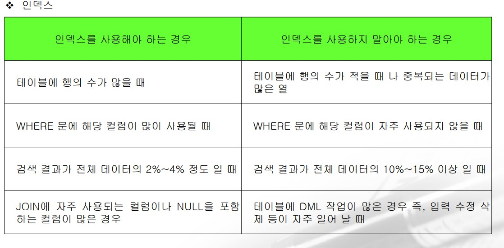

# 테이블 생성
- 테이블이름: contact
- 컬럼
    - num :정수
    - name : 문자열 영문 20자까찌 저장하고 자주 변경
    - address: 문자열이고 영문 100자까지 저장하고 자주 변경하지않음
    - tel : 문자열로 영문 20자 까지 저장하고자주 변경됨
    - email :문자열로 영문 100자까지 저장하고 자주 변경됨 
    - birthday: 날짜
- 비밀번호를 저장할때는 대부분의 경우 해시를 수행해서 해시코드를 저장하기때문에
해시방법에 따라 64,128,256으로 설정해야 한다 .
```
create table contact(
    num Integer,
    name char(20),
    address varchar(100),
    tel char(20),
    email char(100),
    birthday date
)ENGINE=MyISAM;
```

### 테이블 구조 변경
- 기본형식
```
alter table 테이블이름 작업 매개변수 나열
```
### 컬럼 추가
```
alter table 테이블이름 add 컬럼이름 자료형 제약조건;

*
```
- contact테이블에 age라는 컬ㄹ럼을 정수로 추가
    - 컬럼을 추가하는 경우 기존에 데이터가 존재했다면 모두 null 삽입
```
alter table contact add age integer;
```

### 컬럼 삭제
- alter table 테이블이름 drop 컬럼이름;
```
alter table contact drop age;
```
 
### 컬럼 변경
- 이름 과 자료형 변경
```
alter table 테이블이름 chage 기존컬럼이름 새로운컬럼이름 자료형 제약조건;
```
- 자료형 만 변경하는 경우 
    - NOT NULL에 대한 설정 포함 
    - 크기가 변경되는 경우 기존의 크기보다 커지는 것은 아무런 문제가 없지만 작아지는 것은 데이터의 손실이 발생할 수 있으므로 주의해야함.

```
alter table 테이블이름 modify 기존컬럼이름 자료형;
```

- 컬럼을 추가하거나 삭제하는 명령은 관계형 데이터베이스에서 거의 비슷하지만 컬럼을 변경하는 명령은 데이터베이스 마다 다르다.

### 컬럼 순서 조정
- 새로운 컬럼이 추가되면 맨 뒤에 추가 
- 컬럼을 맨 앞으로 이동 
```
alter table 테이블 이름 modify column 컬럼이름 자료형 first;
```
- 컬럼을 특정 컬럼 뒤로 이동
```
alter table 테이블이름 modify column 컬럼이름 자료형 after 앞에 있을 컬럼이름;
```

### 테이블 이름 수정
```
alter table 원래테이블이름 rename 새로운 테이블이름;
```

### 테이블 삭제 
- 기본형식
    - drop table 테이블이름;

### 테이블이 삭제가 되지 않는 경우
> 외래키로 참조되는 테이블은 외래키를 소유하고 있는 테이블이 먼저 삭제되어야한다.


### 테이블의 모든 데이터 삭제 

```
TRUNCATE TABLE 테이블이름;
```

### 테이블 압축
```
create table 다음에 ROW_FORMAT=COMPRESSED 옵션을 추가하면 테이블을 압축해서 생성됨
```
- 저장 공간을 줄일 수 있지만 작업 속도는 느려진다.

### 주석 설정
```
comment on table 테이블이름 IS '주석';
```

### 제약조건 (Constraint)
- 무결성 제약 조건 
    - Entity Integrity(개체 무결성) : 기본키는 NULL이거나 중복될수없다.
    - Referential Integrity(참조 무결성): 외래키는 참조할 수 있는 값이나 NULL을 가져야한다.
    - Domain Integrity(도메인 무결성): 속성의 값은 정해진 도메인을 가져야 한다.

#### NOT NULL
- NULL일 수 없다 라는 제약조건
- 필수입력
- 컬럼의 크기와 관련이 있기 떄문에 컬럼을 만들때 제약조건을 설정해야한다.
    - 테이블 제약조건으로 만들 수 없다.
    - 컬럼이름 자료형 NOT NULL 의 형태로 설정
-  기본은 NULL 허용

### DEFAULT
> 데이터베이스 이론에서는 DEFAULT는 제약조건이 아님.
- 입력하지 않았을 때 기본적으로 삽입되는 데이터
- DEFAULT 값 의 형태로 지정 
    - 숫자는 0 
    - 문자열의 경우는 "이나 'N/A'등을 많이 설정하고 날짜의 경우는 현재 시간(CURRENT_TIMESTAMP 나 NOW등) 을 많이 사용  

### CHECK
> 값의 종류 나 범위를 제한하기 위한 제약조건 
- 설정방법
```
CHECK(컬럼이름 조건);
```

- GENDER 컬럼은 문자 3자 인데 남 또는 여 만 가져야하는 경우
```
GENDER CHAR(3) CHECK(GENDER IN ('남','여'));
```

- SCORE 컬럼은 정수인데 0 ~ 100 까지의 값만 가져야 하는 경우
```
SCORE INTEGER CHECK (SCORE BETWEEN 0 AND 100);
```

### PRIMARY KEY (기본키)
> 테이블에서 PRIMARY KEY 는 한 번 만 설정 가능
- 2개 이상의 컬럼으로 PRIMARY KEY를 설정하는 경우는 테이블 제약조건으로 설정해야함
    - 학습을 할 때는 복합키를 거의 사용하지 않지만 실무에서 복합키를 사용하는 경우가 종종 발생함.

- MEMBER 테이블에서 ID 를 PRIMARY KEY 로 설정
```
create table member(
    ID varchar(50),

    PRIMARY KEY(ID) # 이경우를 컬럼 제약조건이라함 
)


* 기본키는 프라이머리키를 두번설정하면안됨.
* 만약 설정해야한다면 
CREATE TABLE member(
    ID varchar(50),
    nickname varchar(50),
    ..
    ..
    PRIMARY KEY(ID,name) # 이런 형식으로 설정해야한다. 두번설정할려면
)
```
- PRIMARY KEY 를 이용해서 조회할 때 가장 빠른 성능을 나타낸다
- PRIMARY KEY 를 설정하는 것은 중요한 작업 중의 하나이다
- PRIMARY KEY 는 <b>NOT NULL 이고 UNIQUE</b>하다.

### UNIQUE
- 중복값을 가질 수 없도록 하는 제약조건
- <b>NULL 허용</b>
- 인덱스를 생성하는데 PRIMARY KEY 가 없으면 UNIQUE 가 클러스터 인덱스가 되고 PRIMARY KEY 가 있으면 보조 인덱스가 된다
- PRIMARY KEY 와 더불어 다른 테이블에서의 FOREIGN KEY 가 될 수 있다.
    - 시험에서는 PRIMARY KEY 만 FOREIGN KEY 가 될 수 있다고 한다.

### 제약조건 이름 설정
- 제약조건을 설정할 때 앞에 CONSTRAINT 제약조건이름 을 추가하면 제약조건 이름이 만들어진다.

- 일반적으로 테이블 이름 과 제약조건의 약자를 조합해서 만드는 경우가 많다.
    - PRIMARY KEY 
        - pk
    - NOT NULL
        - nn
    - UNIQUE 
        - uk
    - CHECK 
        - ck
    - FOREIGN KEY 
        - fk
```
create table member(
    id varchar(50),
    name varchar(50),
    ,,
    ,,
    constraint member_pk primary key(id,name);
);
```

### 제약조건 수정
- 제약조건 수정
```
alter table 테이블이름 modify 컬럼이름 자료형 [constraint 이름] 제약조건;

*[] 들어가면 해도되고 안해도된다라는의미 
```

### 제약조건 추가
```
alter table 테이블이름 add [constraint 이름] 제약조건 (컬럼이름);
```
- NOT NULL 을 추가ㅎ로 설정하는 경우는 제약조건을 추가하는 것이 아니고 컬럼의 자료형을 수정하는 것이다.

### 제약조건 삭제 
```
alter table 테이블이름 drop constraint 제약조건이름;
```

### Sequence(일련번호)
> 컬럼 이름 뒤에 auto_increment 를 설정하면 일련번호가 만들어진다
- AUTO_INCREMENT 가 설정된 컬럼은 값을 대입하지 않아도 된다
    - 테이블을 생성할 때 초기 값을 설정할수있다
```
alter table 테이블이름 auto_increment =값;
```
- auto_increment는 pk 나 uk를 설정해야하고 테이블에서 한 번만 사용가능

### 참조 무결성
> tEmployee 테이블 과 tProject 라는 테이블을 생성
- tEmployee 테이블은 직원에 대한 정보를 가진 테이블이고 tProject직원이 수행한 ㅡㅍ로젝트에 대한 정보를 가진 테이블 

- foreign key 를 설정하지 않은 경우 
```
create table tEmployee (
    name varchar(20) PRIMARY KEY,
    salary INTEGER NOT NULL,
    addr CHAR(100) NOT NULL
);
```

### 외래키 설정
> 외래키는 상대방 테이블에서 PRIMARY KEY 나 UNIQUE 제약 조건이 설정되어있어야함.

- 컬럼 제약 조건으로 설정
```
컬럼이름 자료형[constraint 제약조건이름] references 참조하는 테이블이름(컬럼이름) 옵션
```

- 테이블 제약조건 설정
```
[constraint 제약조건이름] foreign key(컬럼 이름)references 참조하는 테이블이름(컬럼이름) 옵션
```
- 외래키는 널 가능
- 외래키를 설정한 컬럼에 insert 할경우 참조하는 테이블에 해당 외래키 값이 존재하지않으면 error발생

### 외래키 옵션
> 옵션없이 foreign key 설정 시 외래키로 참조되는 데이터는 삭제할 수 없다.

- 참조되지 않는 데이터는 삭제가 가능하다.
- 외래키에 의해서 참조되는 테이블은 먼저 삭제할 수 없고 외래키를 소유하고 있는 테이블을 삭제하고 삭제해야함.


### 외래키 설정할 때 옵션 등
- ON DELETE [NO ACTIOIN | CASCADE | SET NULL | SET DEFAULT]

- ON UPDATE [NO ACTIOIN | CASCADE | SET NULL | SET DEFAULT]

- NO ACTION 
    - 아무 것도 하지 않음
- CASCADE 
    - 같이 삭제되거나 수정
- SET NULL
    - NULL 변경
- SET DEFAULT 
    - DEFAULT 값으로 변경
- ON UPDATE 는 잘 사용하지 않는데 이유는 일반적으로 PRIMARY KEY는 불변의 성격을 갖기 때문이다.

### 외래키 SET NULL 지정

```
create table tProject(
    ...
    name VARCHAR(20) REFERENCES tEmployee(name) ON DELETE SET NULL,
    ...
)
```
- name에 대한값을 삭제할경우 name 컬럼의 값만 null로 바뀐다.


# DML 과 Transaction

## DML (Data Manipolation Language)
> 데이터를 테이블에 삽입,삭제,갱신 하는 SQL

### 데이터 삽입
```
insert into 테이블이름 (컬럼 이름을 나열)
values(값을 나열);
```
- 컬럼 이름을 생략하면 모든 컬럼의 값을 테이블을 만들 때 사용했던 순서대로 대입해야한다.

### null 삽입
- 기본값이 없는 경우에는 컬럼 이름을 생략하고 삽입
- 명식적으로 값을 null 이라고 설정
- 문자열의 경우는 " 형태로 입력해도 null로 간주하는 데이터베이스가있다.

### 여러 개의 데이터를 한꺼번에 삽입 

```
insert into 테이블이름(컬럼 이름 나열)
values(값을 나열)(값을 나열)... ... ... 

# 이런식으로 해준다.
```

### 조회한 결과를 가지고 테이블 생성
```
create table 테이블이름 as
select 구문;
```

### 에러 무시하고 삽입
- 스크립트를 이용할 때 중간에 에러가 발생해도 데이터를 삽입하고자 하는 경우에는 insert ignore into 구문을 이용하면된다


### 데이터 삭제 
- 기본형식
```
DELETE FROM 테이블이름 [where 조건];
```
- where 절을 생략하면 테이블의 모든 데이터가 삭제 
    - TRUNCATE 와 유사함
- DELETE 는 트랜잭션을 설정하면 복구가 가능하다.

```
# DEPT 테이블에서 DEPTNO 가 40보다 큰 데이터를 전부 삭제
delete from DEPT
where DEPTNO >40;
```

- INSERT 는 성공을 하면 반드시 1개 이상의 행이 영향을 받지만 DELETE 나 UPDATE는 0개 이상의 행이 영향을 받는다

- where 절 있기 때문에 조건에 맞는 데이터가 없으면 영향받은 행의 개수는 0이다. 

- 외래키 옵션 없이 생성되면 삭제가 되지 않을 수도 있다.


### 데이터 수정
```
update 테이블이름
set 수정할컬럼 = 값 ...
[where 조건]; 
```
- where 절 생략시 데이블의 모든 데이터가 수정됨
- tCity 테이블의 name 이 서울인 데이터의 pupu는 100으로 region은 전라 로 수정
```
update tCity
set popu=1000,region='전라'
where  name= '서울'
```

# Transaction
> 한 번에 수행되어야하는 논리적인 작업의 단위
- 1개 이상의 DML 문장으로 구성이 된다.

- 예시
```
A 와 B 가 SWORD 라는 아이템을 10000 원에 걸
데이터베이스에서는 하나씩 작업을 수행
A 유저에게서 SWORD를 삭제
B 유저에게서 SWORD를 추가
A 유저에게 10000원 추가
B 유저에게 10000원 삭감
```

### 트랜잭션이 가져야 하는 성질
- Atomicity(원자성) : ALL OR NOTHING 
    - 전부 아니면 전무

- Consistency(일관성)
    - 트랜잭션 수행 전 과 수행 후의 결과가 일관성이 있어야한다.

- Isolation(격리성,독립성)
    - 하나의 트랜잭션은 다른 트랜잭션의 영향을 받으면 안되고, 독립적으로수행되어야한다.

- Durability(영속성,지속성)
    - 한번 완료된 트랜잭션은 영원히 반영되어야 함. (수정할 수 없다.)

## 트랜잭션 구현의 원리
- DML 작업을 수행할 대는 원본 데이터에 작업을 수행하는 것이 아니고 임시 작업 영역을 만들어서 그 영역에 데이터를 복제해서 작업을 수행한다. 

### COMMIT
><b>작업을 전부 완료 하면 원본에 변경 내역을 반영함</b>

### ROLLBACK
> <b>작업을 수행하는 도중 실패시 변경 내역을 원본에 반영하지 않는다.</b>

### 트랜잭션 명령어
- COMMIT
    - 원본에 반영
- ROLLBACK
    - 원본에 반영하지않는 것
- SAVEPOINT
    - ROLLBACK 할 위치를 선정


# 트랜잭션 모드 
- Manual Commit
    - 사용자가 직접 COMMIT 과  ROLLBACK 을 하도록하는 모드 
- Auto
    - 하나의 명령어가 성공적으로 수행되면 자동으로 COMMit을 하는 모드
    - 프로그래밍 언어에서 데이터베이스를 연결하거나 접속 도구 등에서 데이터베이스 서버에 접속해서 작업을 수행하는 경우 Auto 로 설정되는 경우가 있다.

### 트랜잭션 생성 시점
- DML 문장이 성공적으로 완료되면 생성

### 트랜잭션 종료 시점 
- COMMIT 이나 ROLLBACK을 수행한 경우
- DDL 문장을 수행하면 트랜잭션은 종료 

### AUTO COMMIT 
> 자동으로 COMMIT 이 되는 경우 
- DDL 
    - CREATE,ALTER,DROP,TRUNCATE
- DCL
    - GRANT, REVOKE
- 접속 프로그램을 정상적으로 종료된 경우

### AUTO ROLLBACK
> 자동으로 ROLLBACK 되는 경우
- 접속이 비정상적으로 종료된 경우


```
# DEPT 테이블의 모든 내용을 가지고 DEPT01 테이블 생성

create table DEPT01
as select * from DEPT;


# delete 문장을 성공적으로 수행하므로 TRANSACTIOIN이 생성됨
delete from DEPT01;


# DEPTNO 가 20 인 데이터를 삭제
delete from DEPT01
where DEPTNO =40; - 삭제된 시점에서 트랝ㄳ생성

select * from DEPT01; - 40없어짐
ROLLBACK;  - 40 이있었을때로 돌아감
commit;   - 트랜잭션 종료 

# 메뉴얼 커밋을 누르고 해야함
```

- ROLLBACK;
    - 테이블을 생성한지점으로 롤백 
    -  만든 savepoint 다제거 
- ROLLBACK to s1;
    - savepoint s1 지점으로 ㄷ돌아감

```
delete from DEPT01 where DEPTNO =40;

savepoint s1;

delete from DEPT01 where DEPTNO =10;
savepoint s2;
delete from DEPT01 where DEPTNO =30;
savepoint s3;
```


- s1 으로 돌아갔기때문에 s2는 사라짐.
```
rollback to s1;
select * from DEPT01;

rollback to s2 # error
```

### LOCK
- 2가지 LOCK이 존재
- Shared LOCK 이고 Exclusive LOCK 2가지 종류인데 Shared LOCK은 공유 가능한 LOCK 이고 Exclusive LOCk 은 공유가 불가능한 LOCK이다
- 읽기 작업
    - Shared LOCK이 설정됨 
        - 이 외는 Exclusive Lock이 걸리게됨, 이 경우는 트랜잭션이 종료되어야만 LOCK이 해제된다
### TRANSACTION MODE  (MAUAL 로사용하는경우)
- 하나의 컴퓨터에서 DML 작업을 수행하고 COMMIT 이나 ROLLBACK을 하지 않은 상태에서 다른 컴퓨터에서 SELECT를 하는 것은 아무런 문제가 없지만 DML 작업이나 DDL 작어븡ㄹ 수행하는 것은 안되는데 무한 루프에 빠지게된다 .
- LOCK 의 기본 단위는 테이블 
- 읽기쓰기 수정이 안되면 묶였다고생각하셈 
    - mysql은 껏다키면 되지만 oracle 은안된다고함 .


## 테이블 이외의 객체
> view 나 PROCEDURE , TRIGGER , index 가 데이터베이스 사용 성능을 향상시키기 위한 개체인데 최근의 프로그래밍에서는 IN MEMORY DB 개념의 형태를 사용하기때문에 이 개체들을 사용하는 이점이 별로없다.

### VIEW
- 자주 사용하는 select 구문을 하나의 테이블의 형태로 사용하기 위한 개체

- <b>장점</b> 
    - select 구문을 메모리에 적재하기 때문에 속도가 향상
    - 필요한 부분만 노출하면 되기 떄문에 보안이 향상

- Inline View
    - FROM 절에 사용한 SELECT 구문
    - SELECT 구문이 리턴하는 결과는 하나의 테이블 처럼 사용이 가능 하기 때문에 
    FROM 절에 사용하는 것이 가능
    - select 구문의 결과는 이름이 없어서 다른 절에서 사용할 수  없기 때문에 반드시 이름을 새로 만들어주어야한다.
    - ORACLE 에서 OFFSET FETCH 가 적용되기 전에는 Inline View를 이용해서 TOP-N을 구현 했기 때문에 오라클에서는 매우 중요
```
select *
from (select * from tStaff where grade='과장' OR grade ='부장')
where IMSI.score >=70;
```

### 정훈참조  VIEW
- https://reeme.tistory.com/54

### VIEW 생성
```
create [OR REPLACE] VIEW 뷰이름 
as select 구문 
[WITH CHECK OPTION]
[WITH READ ONLY]
```
- VIEW 는 ALTER로 수정이 불가능하다.
    - 수정이 불가능 하기때문에 OR REPLACE 사용
- VIEW는 테이블처럼 사용할 수 있기 때문에 읽기 와 쓰기 작업이 가능
- WITH CHECK OPTION 은 뷰를 만들 때 사용한 조건과 일치하는 데이터만 수정하거나 삭제 또는 삽입 할 수 있도록 해주는 옵션 

### view 삭제
```
drop view 뷰이름;
```

## 실습 
> DEPT 테이블에서 DEPTNO 가 30인 데이터를 자주 사용

- 이제부터는 DEPTVIEW 가 select * from DEPT where DEPTNO=30 의 역할을 수행
    - 한번 컴파일이 되면 SQL에 메모리에 상주하기 때문 에 빠름
```
select *from DEPT where DEPTNO =30;


create VIEW DEPTVIEW
as select *from DEPT where DEPTNO =30;
```


```
# DEPTCOPY 테이블에서 DEPTNO 가 20이 넘는 데이터를 가지고 DEPTVIEW 라는 VIEW를 생성

create or replace view DEPTVIEW
as 
select *
from DEPTCOPY
where DEPTNO>20;

select * from DEPTVIEW;
```

- <b>VIEW 는 SQL을 가지고 있는 것이지 실제 데이터를 가지고 있는 것이 아님</b>

- VIEW 에 데이터 삽입시
    - <b>원본 테이블에 삽입</b>
### 뷰삭제
```
drop view DEPTVIEW;
```

# 절차적 프로그램잉
> SQL 은 비절차적 (작성한 순서대로 동작하지 않는다)
```
select 
from 
이렇게 작성하지만 실제 실행 순서는 FROM -> SELECT 가 수행됨
```
- 관계형 데이터베이스에서도 절차적 프로그래밍이 가능
- 문법은 관계형 데이터베이스 종류마다 다름


### stored Procedure
- 자주 SQL 구문을 함수처럼 미리 만들어두고 이름만으로 실행하도록 해주는 객체
- 함수 와 다른 점은  함수는 리턴을 하짐나 리턴을 하지 않음
- 장점 
    - 한번 실행하고 나면 메모리에 상주를 하기 때문에 성능이 향상
    - 테이블의 구조를 몰라도 작업이 가능하기 때문에 보안이 향상

- 생성방법
```
DELIMITER 기호 2개
CREATE [or replace] PROCEDURE 이름 (매개변수)
BEGIN
    필요한 Sql 프로그래밍
END 기호 2개
DELEMITER;
```

- 생성을 할때는 하나의 SQL 구문이 아니기 때문에 스크립트 실행의 형태로 수행

### 호출 
- call 프로시저이름(매개변수 나열);


### 삭제
- DROP PROCEDURE 이름;

- ORM 이 아닌 SQL Mapper를 이용하는 경우 필수적으로 한 개 이상

```
DELIMITER //
create or replace PROCEDURE  myproc(
vdeptno int(2),
vdname varchar(14)
, vloc varchar(13))
begin 
	INSERT INTO DEPT (DEPTNO,DNAME,LOC)
	values(vdeptno,vdname,vloc);
end //
DELIMITER ;

call myproc(3,'2','3'); # 프로시저 만든거 실행 

select * 
from DEPT;

# call 프로시저로 인하여 데이터가 들어가는게 보임

```

## TRIGGER
> 어떤 사건 (INSERT ,UPDATE,DELETE)이 발생했을 때 절차적프로그래밍 부분을 자동으로 수행하기 위한 개체
- 유효성 검사를 해서 SQL 을 실행하지 않도록 하거나 DML 작업을 수행했을 때 로그를 기록하거나 다른 DML 작업을 연쇄적으로 실행하는 등의 작업을 주로 수행
- 애플리케이션 개발자 입장에서는 프로그래밍으로 처리할려고 하기 때문에 잘 사용하지 않지만 보안을 위해서는 사용하는 것도 나쁘지않음

### 삽입 트리거 
> 하나의 테이블에 데이터를 삽입하면 다른 테이블에 데이터가 자동으로 삽입되도록 하는 트리거 
#### 사용 예시 
> 블로그 같은 곳에서 ㅗ히원가입을 하면 가입한 회원의 데이터를 관리할 수 있는 테이블을 별도로 생성하는 경우가 있다.)


```
# 데이터를 삽입할 테이블
create table EMP01(
    EMPNO INT PRIMARY KEY,
    ENAME VARCHAR(100),
    JOB VARCHAR(30)
);


# 트리거로 데이터를 삽입할 테입르

create table SAL01(
    SALNO INT PRIMARY KEY AUTO_INCREMENT,
    SAL FLOAT(7,2),
    EMPNO INT REFERENCES EMP01(EMPNO) ON DELETE CASCADE
);


# 삽입 트리거
DELIMITER //
create or replace TRIGGER TRG_01
AFTER INSERT 
ON EMP01
FOR EACH ROW
BEGIN 
	# EMP01에 삽입할때 요구문을 실행하겠다.
	INSERT  INTO  SAL01(SAL,EMPNO) values(100,NEW.EMPNO);
END //
DELIMITER ;
```

```
# 확인결과
select * from EMP01;
select * from SAL01;
insert into EMP01 values(1,'adam','singer');

# SAL01에는 넣어준적이없는데 확인해보면 넣어져있다. 그 이유는 
# 삽입 트리거 때문이다.
```


# 최적화 

