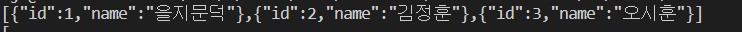
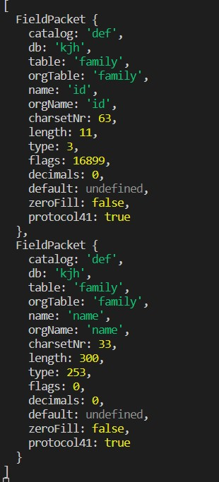

# Node + Maria DB
> 프로그래밍 언어에서 관계형 데이터베이스를 사용하는 방법
- 데이터베이스 제조업체에서 제공하는 드라이버를 사용하거나 SQL MAPPER Framework를 사용하는 방식

- ORM Framework 이용 
    - sql을 이용하지않고 객체 지향 언어의 메서드를 이용해서 SQl을 자동 변환해서 수행하는 방식

- 데이터베이스 ㅔㅈ공업체에서 제공하는 드라이버를 이용해서 sql을 실행
    - node 에서는 mariadb는 mysql 과 같은 데이터베이스로 취급함

```javascript
const mariadb = require('mysql');

let connection = mariadb.createConnection({
    host:'192.168.0.156',
    port:3306,
    user:'root',
    password:'1234',
    database:'kjh'
})


//연결

connection.connect((err)=>{
    if(err){
        console.log(err);
        //에러발생했을떄
    }else{
        console.log(connection);

        //테이블 ㅁ생성구문
        connection.query('create table family(id int auto_increment primary key, name varchar(100))');
    //데이터 삽입 구문 
    connection.query('insert into family(name)values(?)','을지문덕');
    connection.query('insert into family(name)values(?)','김정훈');
    connection.query('insert into family(name)values(?)','오시훈');
    }
})


//데이터베이스 연결이 완료되었을떄 

```


# SQL 실행

### select 가 아닌 구문
- 결과가 성공 과 실패 또는 영향받은 개수의 형태
    - 연결객체.query(SQL,[파라미터배열]);
        - 파라미터배열은 SQL 작성할 때 값의 자리에 직접값을 작성하지 않고 ? 로 설정한 후 나중에 값을 대입할수있다.


### select 구문 
>select구문은 콜백함수를 매개변수로 추가하는데 콜백함수의 매개변수가 3개인데 첫번째 에러 객체, 두번째 검색된내인데 javascript 객체 형태로 제공되고 세번째 meta data로 검색된 결과에대한 정보가 보인다

- 조회한 결과 (Cursor 또는 하나의 객체 나 배열)


```javascript
   //테이블 생성구문
    connection.query('create table family(id int auto_increment primary key, name varchar(100))');
    //데이터 삽입 구문 
    connection.query('insert into family(name)values(?)','을지문덕');
    connection.query('insert into family(name)values(?)','김정훈');
    connection.query('insert into family(name)values(?)','오시훈');
```


- 화면에 출력할 거라면 javascript 객체를 그대로 이용하면 되고 데이터 형태로 제공하고자 하면 JSON 문자열로 변환해서 출력해야함.

```javascript
  //select 구문 
connection.query("select * from family ", (err, result, fields) => {
    if (err) {
       //이렇게하면 서버에서밖에안보인다.
        //클라이언트 한테 보내줘야함
       console.log("{result:false}");
       } else {
       //json문자열로 주겠다는얘기
       let results = JSON.stringify(result);
       console.log(results);
       console.log(fields);
        }
})
```

- json 으로 주었을때 


- fields 객체 



### 테이블 1개를 SQL 을 이용해서 연동

- 기능
    - 테이블의 데이터 전체를 가져오기
    - 테이블의 데이터 일부분을 가져오기 (페이지 단위로 가져오기)
    - 데이터 1개를 가져오기
    - 데이터 삽입 ,삭제,갱신
    - 파일 업로드 와 다운로드 
    - 가장 최근에 데이터를 수정한 시간을 기록하고 리턴함

### 서버와 클라이언트 사의 데이터교환
- 접속할 때 마다 서버의 데이터를 가져와서 출력
- 서버의 데이터를 클라이언트에 저장하고 접속할 때마다 서버의 데이터 와 클라이언트의 데이터를 비교햇 ㅓ수정ㅇ이 발생했을 때 만 업데이트 
- 서버의 데이터 와 클라이언트의 데이터를 비교할 수 있어야 하는데 가장 쉬운 방법은 양쪽에서 숫정한 시간을 기록한 후 클라이언트의 수정 시간이 서버의 수정시간보다 이전이면 업데이트를 수행
    


### 필요한 모듈 설치 

- 프로젝트에 설치 
```
npm install express morgan multer mysql cookie-parser express-session express-mysql-session dotenv compression file-stream-rotator
```
- express 
    - 웹 서버 모듈
- morgan 
    - 로그 기록을 위한 모듈
- file-stream-rotator
    - 로그를 파일에 기록하기 위한 모듈
- multer
    - 파일 업로드를 하기위한 모듈
- mysql 
    - mysql 이나 maria db를 사용하기 위한 모듈
- cookie-parser
    - 쿠키를 사요하기위한 모듈
- expresss-session 
    - 세션을 사용하기 위한 모듈
- express-mysql-session 
    - 세션을 mysql 이나 mariadb에 저장하기위한 모듈
- dotenv 
    - .env 파일의 내용을 process.env 로 저장해서 사용하기위한 모듈
- compression 
    - 서버가 처리한결과를 압축해서 클라이언트에게 전송하기 위한 모듈 (트래픽을 죽일목적으로 사용이됨.)

### 개발 모드로 설치
```
npm install --save-dev nodemon
```
- nodemon : 소스코드를 수정하고 다시 서버를 실행하지않고  재시작을 바로할수있도록 해주는 모듈