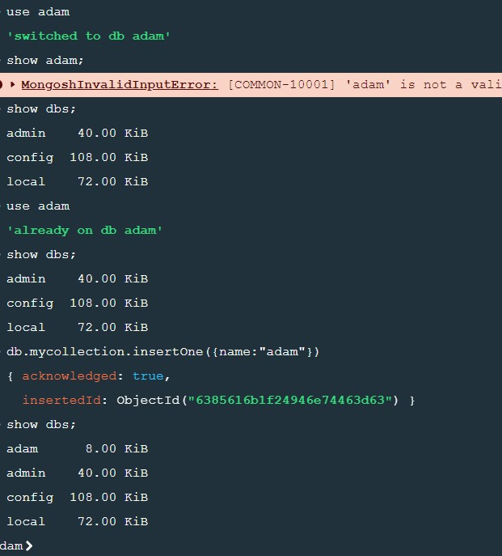
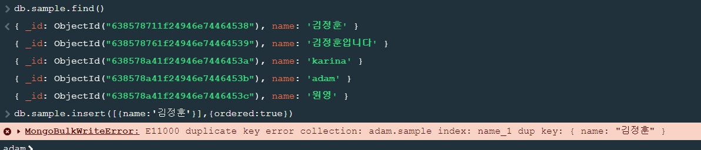

# MongoDB
- 도큐먼트 지향 No SQL
- JSON 형식의 BSON 이라는 데이터 구조를 사용
- 샤딩(데이터를 나누어서 저장하는 기술) 과 복제를 지원 


### 설치 및 접속
> brew 로 설치할려했지만 wsl 버전이 18.04이기때문에 설치를 못하고 windows에서 다운받아서 사용하기로했다. (정훈)
- server설치 
```
MongoDB Compass => windows 설치후 

C:\Program Files\MongoDB\Server\6.0\bin 설치경로 들어간 후 

mongod 메모장 을 열고 0.0.0.0 을하게되면 외부접속을 할 수 있게된다.

MongoDB Compass를 열고 연결을하게되면 연결이된다 
```


- cmd 로 서버실행
    - 첫번째로 C:\Program Files\MongoDB\Server\6.0\bin 이경로를 
        - 환경변수를 넣는다 
- 그 후 cmd 다시실행 후 
```
mongod --dbpath C:\Users\user\Documents\mongodb

뒤에 경로는 자기 db파일을 어디에 저장할것인지 자기가 임의로 지정한 경로를설정
```
- 실행이 됨 

### docker 
```
docker pull mongo

docker run --name mongodb(컨테이너이름) -d -p 27017:27017 mongo(이미지이름)
```

# Mongo DB CRUD
> JSON 형식

- 객체
```
객체: {"속성이름":값, "속성 이름": 값...}
```
- 값에 문자열,숫자, boolean,날짜,null이 올수 있고 다른 객체나 배열이 올 수 있다.
    - 데이터도 모든 종류의 값이 모두 올 수 있다.


### 데이터베이스 작업
> Mongo DB에서 가장 큰 저장소의 개념
- 확인 
    - show dbs;
- 생성
    - 생성은 create로 할 수 있지만 use 데이터베이스이름 으 사용하면 가능
```
use testDBNAME;

//output 
// switched to db testDBNAME;
```
-  데이터베이스를 생성하더라도 데이터가없으면 show dbs에서 출력되지않는다

- 데이터 삽입 
```
db.컬렉션이름.inserOne(객체);

db.mycollection.insertOne({name:"adam"})
```



## Collection

> 관계형 데이터베이스의 테이블과 유사하지만 모든 종류의 데이터를 저장할 수 있다느 측면에서 보면 테이블과 다르다

- 대부분 동일한 모양의 데이터만 저장

### collection생성

```
db.createCollection("이름")
```

- 컬렉션을 만들지않고 처음 사용하면 자동 생성

- 현재 존재하는 컬렉션을 확인하는법
```
show collections
```

- 컬렉션 제거 

```
db.컬렉션이름.drop()
```
- 컬렉션 이름 변경
```
db.컬렉션이름.renameCollection(변경할이름)
```

- Capped Collection
    - 크기를 제한해서 생성할 수 있는 컬렉션으로 크기보다 많은 양의 데이터를 저장하고자 하면 오래된 데이터가 삭제되면서 저장이된다.
```
db.createCollection(컬렉션이름,{capped:true,size:크기})
```

- 크기 단위는 byte

- 컬렉션 데이터 확인
```
db.컬렉션이름.find()
```

### Document생성  - 데이터삽입
> 데이터는 객체 형태로 삽입을 해야한다.

- _id 라는 속성을 설정하지 않으면 Mongo DB가 ObjectId 타입으로 _id 값을 생성해서 삽입합니다
    - 이 값이 Primary key 이면서 index이다 
- 삽입
    - insert
    - insertOne 
    - insertMany
    - save 
- 하나의 데이터를 삽입할 대 사용하고 insertMany는 여러개의 데이터를 삽입할때사용
- insert는 현재 버전에서는 deprecated 
- insertOne은 하나의 데이터를 대입하지만, insertMany는 배열의 형태로 대입하면 된다.
- root가 배열인 경우 데이터를 분할해서 삽입 

```
db.users.insert([{name:"matt},{name:"lara"}])

db.users.find()
```

- 데이터를 삽입할 때 두번째 매개변수로 ordered 옵션에 true를 설정하면 single thread 형태로 데이터를 삽입하고 false를 설정하면 멀티 스레드 형태로 삽입한다.스레드는 다른 스레드에 영향을 주지 않는다 .

- ordered가 true이면 중간에 삽입 실패를 하면 다음 작업을 수행하지 않지만 ordered 를 false로 설정하면 중간에 작업이 실패하더라도 나머지 작업을 수행한다.

```
db.sample.createIndex({name:1},{unique:true})

db.sample.insert([{name:1},{name:"김정훈"}],{ordered:true})

//등등 일때  ordered:true이면 싱글스레드로 동작하기때문에 만약 name이 이미
// 존재하는 이름을 넣엇을경우 error가 발생함.
```



- 반면 ordered:false 면 별도의 스레드 이기 때문에 
    - [김정훈,장원영] 이런식으로 삽입을했을경우 맨처음 ordered:true일경우엔 insert할시 김정훈 이있다면 에러가발생하고 find 하였을때 안보이지만
    - [김정훈,장원영] ordered:false일경우엔 insert할시 에러가 발생하여도 똑같은 이름이 들어감 

### ObjectId
> 컬렉션에 기본키를 생성하기 위해서 제공되는 자료형 (자료형으로 12byte로 구성)

- 직접 설정하는 것도 가능한데 이경우에는 new ObjectId()로 인스턴스를 생성해서 대입하면된다

### 조회
> db.컬렉션이름.find(<query>,<projection>)

- selection
    - select 구문에서 where 절에 해당하는 것으로 조건을 가지고 테이블을 수평 분할하기 위한 연산

- projection
    - select 구문에서 select절에 해당하는 것으로 컬럼 이름을 가지고 테이블을 수직 분할하기 위한 연산

- 조건을이용한 조회
```
db.컬렉션이름find({조건})

// 컬렉션의 name이 아담인 데이터찾기 

db.sample.find({name:"adam"})
```

- 하나의 객체에 여러 속성의 값을 나열하면 and이다

```
db.containerBox.find({category:"animal",name:"호랑이"})
```

- 컬럼을 추출할 경우 
```
db.컬렉션이름.find({},{속성이름:true또는 false ...})


// true 이면 출력되고 false이면 출력되지않는다 .
```

### 비교연산자
- $eq
    - =
- $ne
    - !=
- $gt
    -  ! >
- $gte
    - ! >=
- $lt
    - <
- $lte
    - <=
- $in
    - in
- $nin
    - not in

```
예시
db.examples.find({$eq:"nadma"})

db.examples.find({$ge:90})

db.examples.find({$in:["adam","matt"]})

```

- 조회를 할때 문자열자리 정규식 표현식을 사용하는 것이 가능함
```
db.users.find({name:{$in[/^b/]}})
```
### 논리연산자
> not을 제외하고는 조건을 배열의 형태로 설정
- $not
- $or
- $and
- $nor (not or)
```
// inventory 에서 qty가 100보다 크거나 qty가 10 보다 작은 데이터 조회

db.inventory.find({$or:[{qty:{$gt:100},{qty:{$lt:10}}}]})
```

### 문자열 검색 - 값에 정규식 사용 가능
> 샘플 데이터 삽입
- db.users.insert({name:'김구라'})

- a가 포함된 데이터 조회 
```
db.users.find({name:/a/})
```

- pa로 시작하는 데이터 조회 
```
db.users.find({name:/^pa/})
```
- ro로 끝나는 데이터 조회
```
db.users.find({name:/ro$/})
```

### 데이터 개수 제한 limit함수
```
//테이블에서 데이터 2개만 조회

db.users.find().limit(2)
```

### 데이터 건너뛸때 함수 skip
```
db.users.find().skip(1)
```
- <b> 1개만 조회시에는 findOne 함수를 이용해도 됨<b>

### 데이터 정렬
```
//sort함수 

sort({속성이름 :1 이나 -1})

//1은 오름차순이고 -1은 내림차순
```
- 속성 이름 대신에 natural 을 이용하면 삽입한 순서대로 조회가 가능하다


### Cursor
- find함수의 결과로 리턴되는 자료형으로 도큐먼트를 순서대로 접근할 수 있도록 해주는 포인터
    - Enumeration(Enumerator)나 iterator 와 유사한 개념
    - hasNext() 함수 와 next() 가 존재하는데 다음 데이터의 존재 여부를 리턴하고 뒤의 함수는 다음 데이터를 리턴한다.

### 수정
> 함수
- update
    - update({조건},{수정할 형식})
```
{$set:{속성이름:수정할 데이터 , ... ... ...}}

db.users.update({name:"adam"},{$set:{score:100}})
```
- updateOne

- updateMany
- replaceOne

### 삭제

```
db.users.remove({name:"김정훈"})
```

### 트랜잭션 처리 
- monogo DB는 느슨한 트랜잭션을 지원
- 트랜잭션 처리가 중요한 업무에서는 MongoDB를 잘 사용하지않음


### 트랜잭션 시작
```
session = db.getMongo().startSession()
session.startTransaction();
```

- 작업수행
```
session.commitTransaction이나 session.abortTransaction()
```

# Node + MongoDB
> mongoose(Node 의 ODM)

- 연결코드 

```javascript
let MongoClient = require('mongodb').MongoClient

MonClient.connect('mongodb://아이디:비밀번호@ip:포트번호',(err,database)=>{
    if(err){
        //err 발생시 처리 
    }else{
        //정상적으로 처리 되었을때 처리 
    let db= database.db('데이터베이스이름');

    }
})
```